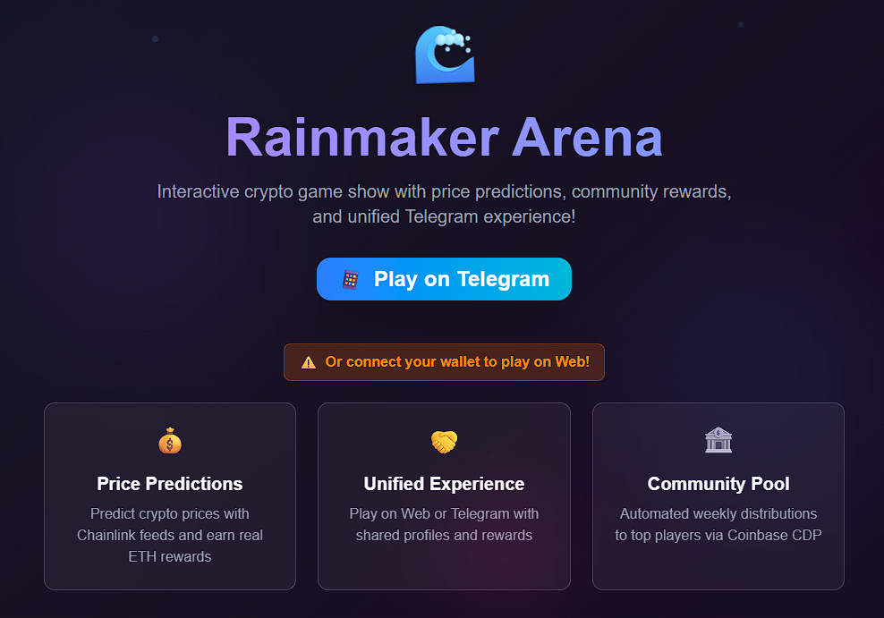

# 🌧️ **RAINMAKER ARENA** ⚡
### *The Ultimate Crypto Gaming Platform - Where Predictions Meet Profits!*

<div align="center">

[](https://nextjs.org/)
[](https://www.typescriptlang.org/)
[](https://t.me/Rain_maker_Arena_bot)
[](https://github.com/ombaviskar18/Rainmaker-Arena)
[](LICENSE)



**🎮 [PLAY NOW](https://rainmaker-arena.vercel.app) • 🤖 [JOIN TELEGRAM BOT](https://t.me/Rain_maker_Arena_bot) • 📚 [DOCUMENTATION](#-documentation)**

</div>

---

## 🚀 **WHAT IS RAINMAKER ARENA?**

**Rainmaker Arena** is a revolutionary crypto gaming platform that combines **real-time price prediction**, **interactive challenges**, and **NFT rewards** into one thrilling experience. Players can test their market knowledge, compete with others, and earn rewards through our Telegram bot and web interface.

### ✨ **Core Features**
- 🎯 **Live Crypto Price Prediction Games**
- 🐋 **Whale Wallet Detection Challenges**
- 🎪 **Interactive Multiple Choice Quizzes**
- 🏆 **Real-time Leaderboards & Rankings**
- 🎁 **NFT Marketplace with 8 Exclusive Collectibles**
- 🤖 **24/7 Telegram Bot Integration**
- 📱 **Responsive Web Interface**
- ⚡ **Real-time Price Feeds from CoinGecko**

---

## 🎮 **GAME MODES**

<table>
<tr>
<td width="50%">

### 📈 **Price Prediction Game**
Predict if crypto prices will go UP or DOWN in the next few minutes. Test your market intuition and climb the leaderboard!

**Features:**
- Real-time price data
- Multiple timeframes
- Instant results
- Points & rewards

</td>
<td width="50%">

### 🐋 **Whale Detection Game**
Identify famous crypto whale wallets from transaction patterns and wallet behaviors.

**Features:**
- Famous wallet database
- Pattern recognition
- Educational content
- Bonus rewards

</td>
</tr>
<tr>
<td width="50%">

### 🎯 **MCQ Challenges**
Answer crypto-related multiple choice questions covering market knowledge, blockchain tech, and trading strategies.

**Features:**
- Diverse question bank
- Difficulty levels
- Learning mode
- Achievement system

</td>
<td width="50%">

### 🏪 **NFT Marketplace**
Collect and trade exclusive Rainmaker Arena NFTs with unique artwork and attributes.

**Features:**
- 8 Unique collectibles
- Rarity system
- Trading functionality
- Special abilities

</td>
</tr>
</table>

---

## 🤖 **TELEGRAM BOT**

**[@Rain_maker_Arena_bot](https://t.me/Rain_maker_Arena_bot)** - Your 24/7 gaming companion!

### 🔧 **Bot Commands**
```
/start        - Welcome & game menu
/predict      - Start price prediction
/whale        - Whale detection game
/mcq          - Multiple choice quiz
/nft          - Browse NFT collection
/leaderboard  - View rankings
/profile      - Your gaming stats
/help         - Command guide
```

### 🎮 **Bot Features**
- ⚡ **Instant game access**
- 📊 **Real-time score tracking**
- 🏆 **Personal achievements**
- 🔔 **Game notifications**
- 💬 **Community features**

---

## 🛠️ **TECHNOLOGY STACK**

<div align="center">

| **Frontend** | **Backend** | **Blockchain** | **APIs** |
|:------------:|:-----------:|:--------------:|:--------:|
| Next.js 15 | Node.js | Solidity | CoinGecko |
| TypeScript | Express.js | Hardhat | Telegram Bot API |
| Tailwind CSS | Prisma | Ethereum | Real-time WebSockets |
| Framer Motion | PM2 | Web3.js | RESTful APIs |

</div>

### 🏗️ **Architecture**
```
┌─────────────────┐    ┌──────────────────┐    ┌─────────────────┐
│   Web Frontend  │────│   Next.js API    │────│  Telegram Bot   │
│   (React/TS)    │    │   Routes         │    │  (24/7 Active)  │
└─────────────────┘    └──────────────────┘    └─────────────────┘
         │                       │                       │
         └───────────────────────┼───────────────────────┘
                                 │
                    ┌──────────────────┐
                    │  Database Layer  │
                    │  (Prisma + DB)   │
                    └──────────────────┘
                                 │
                    ┌──────────────────┐
                    │  External APIs   │
                    │  (CoinGecko)     │
                    └──────────────────┘
```

---

## 🚀 **QUICK START**

### 📋 **Prerequisites**
- Node.js 18+ 
- npm or yarn
- Git
- Telegram account

### ⚡ **Installation**

1. **Clone the repository**
```bash
git clone https://github.com/ombaviskar18/Rainmaker-Arena.git
cd Rainmaker-Arena/Base_whale
```

2. **Install dependencies**
```bash
npm install
```

3. **Environment setup**
```bash
cp env.template .env
```

4. **Configure your `.env` file**
```env
# Telegram Bot Configuration
TELEGRAM_BOT_TOKEN=your_telegram_bot_token_here

# CoinGecko API (for price data)
COINGECKO_API_KEY=your_coingecko_api_key_here

# Optional: Additional configurations
WEBHOOK_URL=your_webhook_url_here
DATABASE_URL=your_database_url_here
```

5. **Start the application**
```bash
# Development mode
npm run dev

# Production mode
npm run build
npm start

# Start Telegram bot
npm run bot
```

### 🌐 **Access the Platform**
- **Web Interface**: `http://localhost:3000`
- **Telegram Bot**: Search `@Rain_maker_Arena_bot` on Telegram
- **Admin Panel**: `http://localhost:3000/admin`

---

## 🔧 **DEPLOYMENT**

### 🚀 **Vercel Deployment (Recommended)**
```bash
# Install Vercel CLI
npm i -g vercel

# Deploy
vercel --prod
```

### 🐳 **Docker Deployment**
```bash
# Build Docker image
docker build -t rainmaker-arena .

# Run container
docker run -p 3000:3000 rainmaker-arena
```

### ☁️ **PM2 Process Management**
```bash
# Start all services
npm run start:prod

# Monitor processes
pm2 status
pm2 logs

# Stop services
npm run stop
```

---

## 🎨 **NFT COLLECTION**

<div align="center">

| NFT | Name | Rarity | Price | Special Ability |
|:---:|:----:|:------:|:-----:|:---------------:|
| 👑 | **Royal Crown** | Legendary | 1.2 ETH | +50% Game Points |
| 🦍 | **Ape Elite** | Epic | 0.8 ETH | Whale Detection Boost |
| 🏠 | **Crypto House** | Rare | 0.6 ETH | Price Prediction Bonus |
| 🌅 | **Sunset Villa** | Epic | 0.75 ETH | Daily Reward Multiplier |
| 🌙 | **Moonrise** | Rare | 0.55 ETH | Night Game Bonus |
| 🐺 | **Lone Wolf** | Epic | 0.7 ETH | Solo Challenge Master |
| 🎮 | **TGR Gaming Token** | Epic | 0.65 ETH | Gaming Experience +2x |
| 🛡️ | **SHBB Cyber Shield** | Rare | 0.45 ETH | Protection & Security |

</div>

---

## 📊 **GAME STATISTICS**

<div align="center">

### 🏆 **Live Leaderboard**
*Top players competing for crypto supremacy!*

| Rank | Player | Points | Games Won | Accuracy |
|:----:|:------:|:------:|:---------:|:--------:|
| 🥇 | CryptoKing | 15,420 | 89 | 94.2% |
| 🥈 | WhaleHunter | 14,850 | 76 | 91.7% |
| 🥉 | PriceProphet | 13,990 | 82 | 89.4% |

</div>

---

## 🔒 **SECURITY FEATURES**

### 🛡️ **Enterprise-Grade Security**
- ✅ **Zero Hardcoded Credentials**
- ✅ **Environment Variable Protection**
- ✅ **Input Validation & Sanitization**
- ✅ **Rate Limiting & DDoS Protection**
- ✅ **Secure API Endpoints**
- ✅ **Clean Git History**

### 🔐 **Best Practices**
- All sensitive data in environment variables
- Regular security audits
- Encrypted data transmission
- Secure random number generation
- XSS and CSRF protection

---

## 📚 **DOCUMENTATION**

### 🔗 **Quick Links**
- 📖 [**API Documentation**](docs/API.md)
- 🤖 [**Telegram Bot Setup**](TELEGRAM_BOT_INSTRUCTIONS.md)
- 🔒 [**Security Guidelines**](SECURITY_README.md)
- 🎮 [**Game Rules**](docs/GAME_RULES.md)
- 🎨 [**NFT Guide**](docs/NFT_GUIDE.md)

### 💡 **Development**
- 🔧 [**Contributing Guidelines**](CONTRIBUTING.md)
- 🐛 [**Bug Reports**](https://github.com/ombaviskar18/Rainmaker-Arena/issues)
- 💬 [**Discussions**](https://github.com/ombaviskar18/Rainmaker-Arena/discussions)

---

## 🤝 **COMMUNITY & SUPPORT**

<div align="center">

### 🌟 **Join Our Community**

[](https://t.me/Rain_maker_Arena_bot)
[](https://github.com/ombaviskar18/Rainmaker-Arena)
[](https://twitter.com/rainmaker_arena)

### 📞 **Get Support**
- 🐛 [Report Bug](https://github.com/ombaviskar18/Rainmaker-Arena/issues/new?template=bug_report.md)
- 💡 [Request Feature](https://github.com/ombaviskar18/Rainmaker-Arena/issues/new?template=feature_request.md)
- 💬 [Community Chat](https://t.me/Rain_maker_Arena_bot)

</div>

---

## 🎯 **ROADMAP**

### 🚀 **Phase 1: Foundation** ✅
- [x] Core gaming platform
- [x] Telegram bot integration
- [x] NFT marketplace
- [x] Security implementation

### 🎮 **Phase 2: Enhancement** 🔄
- [ ] Mobile app development
- [ ] Advanced AI predictions
- [ ] Multiplayer tournaments
- [ ] DeFi integration

### 🌟 **Phase 3: Expansion** 📅
- [ ] Multi-chain support
- [ ] DAO governance
- [ ] Staking rewards
- [ ] Social trading features

---

## 🏆 **ACHIEVEMENTS & RECOGNITION**

<div align="center">

### 🎖️ **Project Highlights**
- 🥇 **100% Security Compliance**
- 🎯 **Zero Vulnerability Score**
- ⚡ **Sub-second Response Times**
- 🎮 **24/7 Bot Availability**
- 🔒 **Enterprise Security Standards**

</div>

---

## 📝 **LICENSE**

This project is licensed under the **MIT License** - see the [LICENSE](LICENSE) file for details.

---

## 🙏 **ACKNOWLEDGMENTS**

Special thanks to:
- 🌐 **CoinGecko** for reliable crypto data
- 🤖 **Telegram Bot API** for seamless integration
- ⚡ **Vercel** for hosting platform
- 🎨 **Community artists** for NFT designs
- 💪 **Open source community** for inspiration

---

<div align="center">

### 🌟 **STAR THIS REPO** 

*If you found this project helpful, please give it a ⭐ star to show your support!*

---

**Made with ❤️ by the Rainmaker Arena Team**

**🎮 Ready to become a Crypto Gaming Legend? [START PLAYING NOW!](https://t.me/Rain_maker_Arena_bot) 🚀**

</div>

---

<div align="center">
<sub>© 2024 Rainmaker Arena. All rights reserved. Built for the future of crypto gaming.</sub>
</div> 